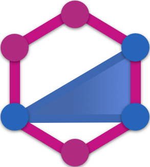

# Will 'Willster' Johnson

<a href="https://discord.com/users/773137363395674133"></a>

[](https://www.docker.com/) [](https://www.mongodb.com/) [](https://nodejs.org/) [](https://expressjs.com/) [](https://typegraphql.com/) [](https://www.apollographql.com/) [](https://svelte.dev/) [](https://www.typescriptlang.org/)

## About Me

### My name is Will Johnson, I'm 19 years old, and I'm a fullstack web developer.

### I work for Carrier Pigeon Advertising LTD in the UK, and I co-direct a start-up game development company called Story Ark.

### My preferred language is TypeScript, and I'm currently learning Svelte and SvelteKit to improve my fullstack skills.


## Find A Thing

[Featured Repo](#Featured-Repo-Express-API-Template)

[VSCode Setup - Extensions](#My-VSCode-Extensions-Setup)

[VSCode Setup - Themes](#My-VSCode-Theme-Setup)

[Pins and Contributions](#Pins-and-Contributions)

## Featured Repos

A collection of repos I wanna show off!

### Svelte Components [Ongoing Development]

An repo where I store reusable components. Don't expect frequent changes, but do expect good quality.

[](https://github.com/willster277/svelte-components)

### SvelteKit Development Template [Ongoing Development]

A template for building fullstack SvelteKit applications.

[](https://github.com/willster277/sveltekit-template)

## My VSCode Extensions Setup

*[There's an easier way](https://github.com/willster277/vscode-recommendations)*

### [Auto Rename Tag](https://marketplace.visualstudio.com/items?itemName=formulahendry.auto-rename-tag)

### [Code Spell Checker](https://marketplace.visualstudio.com/items?itemName=streetsidesoftware.code-spell-checker)

```JSON
"cSpell.allowCompoundWords": true,
"cSpell.diagnosticLevel": "Hint",
"cSpell.maxDuplicateProblems": 100000,
"cSpell.language": "en",
"cSpell.languageSettings": [{
    "languageId": "en",
    "allowCompoundWords": true,
    "caseSensitive": true
}],
```

### [Discord Presence](https://marketplace.visualstudio.com/items?itemName=icrawl.discord-vscode)

### [Docker](https://marketplace.visualstudio.com/items?itemName=ms-azuretools.vscode-docker)

### [ESLint](https://marketplace.visualstudio.com/items?itemName=dbaeumer.vscode-eslint)

### [Git History](https://marketplace.visualstudio.com/items?itemName=donjayamanne.githistory)

### [GitLens](https://marketplace.visualstudio.com/items?itemName=eamodio.gitlens)

### [Markdown Preview Enhanced](https://marketplace.visualstudio.com/items?itemName=shd101wyy.markdown-preview-enhanced)

```JSON
"markdown-preview-enhanced.enableScriptExecution": true,
"markdown-preview-enhanced.previewTheme": "github-dark.css",
"markdown-preview-enhanced.enableHTML5Embed": true,
"markdown-preview-enhanced.enableLinkify": false,
"markdown-preview-enhanced.wikiLinkFileExtension": ".html",
"markdown-preview-enhanced.revealjsTheme": "none.css",
"markdown-preview-enhanced.mermaidTheme": "dark",
```

### [Markdown Formatter](https://marketplace.visualstudio.com/items?itemName=mervin.markdown-formatter)

```JSON
"markdownFormatter.spaceAfterFullWidthOrHalfWidth": "neither",
"markdownFormatter.fullWidthTurnHalfWidth": "",
"markdownFormatter.formatULSymbol": false,
"[markdown]": {
    "editor.tabSize": 2,
    "editor.defaultFormatter": "mervin.markdown-formatter",
    "editor.quickSuggestions": {
        "other": true,
        "comments": true,
        "strings": true
    }
},
```

### [MarkdownLint](https://marketplace.visualstudio.com/items?itemName=davidanson.vscode-markdownlint)

### [Move TS](https://marketplace.visualstudio.com/items?itemName=stringham.move-ts)

### [Path Intellisense](https://marketplace.visualstudio.com/items?itemName=christian-kohler.path-intellisense)

```JSON
"path-intellisense.autoSlashAfterDirectory": true,
"path-intellisense.extensionOnImport": false,
```

### [Prettier](https://marketplace.visualstudio.com/items?itemName=esbenp.prettier-vscode)

```JSON
"prettier.arrowParens": "always",
"prettier.bracketSpacing": true,
"prettier.cursorOffset": -1,
"prettier.embeddedLanguageFormatting": "auto",
"prettier.endOfLine": "lf",
"prettier.filepath": "",
"prettier.htmlWhitespaceSensitivity": "css",
"prettier.insertPragma": false,
"prettier.jsxBracketSameLine": false,
"prettier.jsxSingleQuote": true,
"prettier.parser": "typescript",
"prettier.printWidth": 100,
"prettier.proseWrap": "preserve",
"prettier.quoteProps": "as-needed",
"prettier.requirePragma": false,
"prettier.semi": true,
"prettier.singleQuote": false,
"prettier.trailingComma": "all",
"prettier.tabWidth": 4,
"prettier.useTabs": true,
```

### [SCSS Intellisense](https://marketplace.visualstudio.com/items?itemName=mrmlnc.vscode-scss)

### [Svelte VSCode](https://marketplace.visualstudio.com/items?itemName=svelte.svelte-vscode)

```JSON
"svelte.enable-ts-plugin": true,
"svelte.plugin.svelte.format.config.printWidth": 100,
"svelte.plugin.svelte.format.config.svelteSortOrder": "scripts-markup-styles-options",
```

### [TabNine](https://marketplace.visualstudio.com/items?itemName=tabnine.tabnine-vscode)

```JSON
"tabnine.disable_file_regex": ["[^md]$"],
```

Alternative: [GitHub Copilot (BETA ACCESS)](https://marketplace.visualstudio.com/items?itemName=github.copilot)

```JSON
"github.copilot.autocomplete.enable": true,
"github.copilot.advanced": {
    "debug.autocomplete.fakeDelayMs": 0,
    "autocomplete.maxWaitForResultsMs": 500,
    "debug.autocomplete.showConfidence": true,
    "debug.showScores": true
},
"github.copilot.enable": {
    "*": true,
    "yaml": false,
    "plaintext": false,
    "markdown": false
},
```

### Additional

```JSON
"editor.autoClosingBrackets": "always",
"editor.formatOnType": true,
"editor.wrappingIndent": "indent",
"editor.lineHeight": 24,
"editor.fontSize": 16,
"editor.cursorBlinking": "expand",
"editor.defaultFormatter": "esbenp.prettier-vscode",
"editor.formatOnSave": true,
"editor.formatOnPaste": true,
"editor.cursorSurroundingLines": 5,
"editor.wordWrap": "on",
"explorer.confirmDelete": false,
"explorer.confirmDragAndDrop": false,
"editor.detectIndentation": false,
"editor.insertSpaces": false,
"editor.inlineSuggest.enabled": true,
```

## My VSCode Theme Setup

*[There's an easier way](https://github.com/willster277/vscode-recommendations)*


### [Bracket Pair Colorizer 2](https://marketplace.visualstudio.com/items?itemName=CoenraadS.bracket-pair-colorizer-2)

```JSON
"bracket-pair-colorizer-2.colors": [
    "#f82a5d", "#f57f00", "#e7df60", "#98d800", "#5ccaef", "#a57fff"
],
"bracket-pair-colorizer-2.highlightActiveScope": true,
"bracket-pair-colorizer-2.colorMode": "Independent",
"bracket-pair-colorizer-2.scopeLineCSS": [
    "borderStyle : solid", "borderWidth : 2px", "borderColor : #fff", "opacity: 0.5"
],
"bracket-pair-colorizer-2.showBracketsInGutter": true,
"bracket-pair-colorizer-2.showBracketsInRuler": true,
"bracket-pair-colorizer-2.rulerPosition": "Full",
```

### [Colorize](https://marketplace.visualstudio.com/items?itemName=kamikillerto.vscode-colorize)

```JSON
"colorize.colorized_colors": [
    "HEXA", "RGB", "HSL"
],
"colorize.colorized_variables": [
    "CSS", "SASS", "LESS", "STYLUS"
],
"colorize.languages": [
    "c", "cpp", "css", "html", "javascript", "json", "jsonc", "jsx", "less", "postcss", "python", "sass", "scss", "sss", "stylus", "svg", "typescript", "typescriptreact", "xml", "md", "markdown"
],
"colorize.hide_current_line_decorations": false,
```

### [Indent Rainbow](https://marketplace.visualstudio.com/items?itemName=oderwat.indent-rainbow)

```JSON
"indentRainbow.colors": [
    "#f82a5da0", "#f57f00a0", "#e7df60a0", "#98d800a0", "#5ccaefa0", "#a57fffa0"
],
"indentRainbow.colorOnWhiteSpaceOnly": true,
"indentRainbow.ignoreErrorLanguages": ["*"],
```

### [Material Icons](https://marketplace.visualstudio.com/items?itemName=pkief.material-icon-theme)

```JSON
"material-icon-theme.folders.theme": "specific",
"material-icon-theme.folders.color": "#90a4ae",
"material-icon-theme.showWelcomeMessage": false,
"material-icon-theme.hidesExplorerArrows": true,
"material-icon-theme.files.associations": {
    "config.*": "Settings",
    "*.config.*": "Settings",
    "*.conf.*": "Settings",
    "svelte.config.js": "Settings",
    "package-lock.json": "Nodejs_alt"
},
"material-icon-theme.folders.associations": {
    ".svelte-kit": "Svelte",
    "store": "Database",
    "stores": "Database",
    "components": "Svelte",
    "_components": "Svelte",
    "_template": "Template",
    "shared": "Svelte",
    "module": "Graphql",
    "entity": "Class"
},
"workbench.iconTheme": "material-icon-theme",
```

### [Monokai Pro](https://marketplace.visualstudio.com/items?itemName=monokai.theme-monokai-pro-vscode)

```JSON
"workbench.colorTheme": "Monokai Pro (Filter Machine)",
```

### [oh-my-bash](https://github.com/ohmybash/oh-my-bash) / [ohmyzsh](https://github.com/ohmyzsh/ohmyzsh) (Theme: Agnoster)

### [Victor Mono](https://rubjo.github.io/victor-mono/)

```JSON
"editor.inlineHints.fontFamily": "'victor mono semibold'",
"editor.codeLensFontFamily": "'victor mono semibold'",
"editor.fontFamily": "'victor mono semibold'",
"editor.fontLigatures": true,
```

## Pins and Contributions

They're just below.
