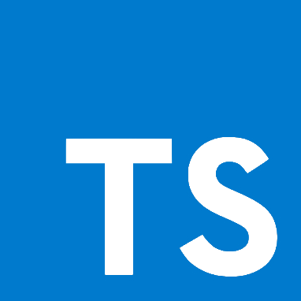
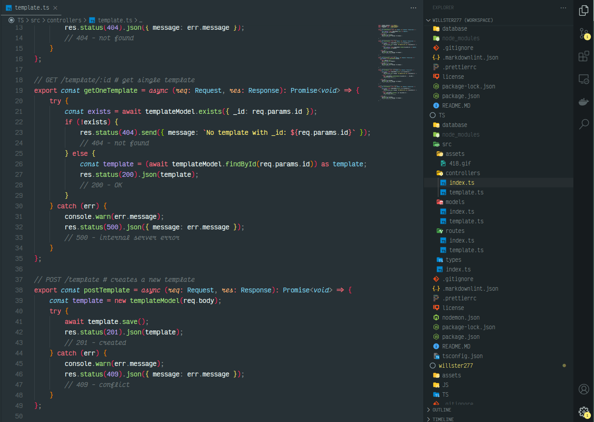

# Will 'Willster' Johnson

<a href="https://discord.com/users/773137363395674133"></a>

## About Me

### My name is Will Johnson, I'm 18 years old, and I'm a fullstack web developer.

### I work for Carrier Pigeon Advertising LTD in the UK, and I co-direct a start-up game development company called Story Ark.

### My preferred language is TypeScript, and I'm currently learning Svelte and SvelteKit to improve my fullstack skills.

&nbsp;&nbsp;&nbsp;&nbsp;


## Find A Thing

[Featured Repo](#Featured-Repo-Express-API-Template)

[VSCode Setup - Extensions](#My-VSCode-Extensions-Setup)

[VSCode Setup - Themes](#My-VSCode-Theme-Setup)

[Pins and Contributions](#Pins-and-Contributions)

## Featured Repo: Express API Template

I've made a repo as a template for [serverside TypeScript](./TS) which you can use to skip the boring process of setting up your project.

[](https://github.com/willster277/typescript-backend-template)

If you don't do TypeScript, I've removed typings and done a little clean-up and made a [JavaScript only version](./JS).

[](https://github.com/willster277/javascript-backend-template)

## My VSCode Extensions Setup

I use [Code Spell Checker](https://marketplace.visualstudio.com/items?itemName=streetsidesoftware.code-spell-checker) to overcome my sloppy typing.

~~And when that isn't enough, I use [TabNine](https://marketplace.visualstudio.com/items?itemName=TabNine.tabnine-vscode) to autocomplete phrases and speed up my workflow.~~ _**I got GitHub Copilot early access! While the beta is ongoing (and probably afterwards too) I will be using Copilot instead of TabNine.**_

To keep track of my docker containers, I use [Docker](https://marketplace.visualstudio.com/items?itemName=ms-azuretools.vscode-docker) and [Remote - Containers](https://marketplace.visualstudio.com/items?itemName=ms-vscode-remote.remote-containers).

Because I use Discord as my main access to programming communities, I use [Discord Presence](https://marketplace.visualstudio.com/items?itemName=icrawl.discord-vscode) to show what I'm working on.

To help with checking colors at a glance in any language, [Colorize](https://marketplace.visualstudio.com/items?itemName=kamikillerto.vscode-colorize) is the way to go.

In any xml (including jsx/tsx) [Auto Rename Tag](https://marketplace.visualstudio.com/items?itemName=formulahendry.auto-rename-tag) is a huge help.

When editing markdown, especially for quickly rendering HTML, [Markdown Emoji](https://marketplace.visualstudio.com/items?itemName=bierner.markdown-emoji) and [Markdown Preview Enhanced](https://marketplace.visualstudio.com/items?itemName=shd101wyy.markdown-preview-enhanced) are useful tools.

As for linting and formatting markdown, I use [Markdownlint](https://marketplace.visualstudio.com/items?itemName=DavidAnson.vscode-markdownlint) and [Markdown-Formatter](https://marketplace.visualstudio.com/items?itemName=mervin.markdown-formatter) respectively.

For linting everything else though, [Prettier - Code Formatter](https://marketplace.visualstudio.com/items?itemName=esbenp.prettier-vscode) is the way to go.

Some great tools to help with path finding in projects are [Path intellisense](https://marketplace.visualstudio.com/items?itemName=christian-kohler.path-intellisense) and [Move TypeScript](https://marketplace.visualstudio.com/items?itemName=stringham.move-ts).

## My VSCode Theme Setup



Im using [Monokai Pro (Machine Filter) Theme](https://marketplace.visualstudio.com/items?itemName=monokai.theme-monokai-pro-vscode).

The font I use is [Victor Mono](https://rubjo.github.io/victor-mono/).

```json
"editor.inlineHints.fontFamily": "'victor mono semibold'",
"editor.codeLensFontFamily": "'victor mono semibold'",
"editor.fontFamily": "'victor mono semibold'",
"editor.fontLigatures": true,
```

The colored tabs come from [Indent Rainbow](https://marketplace.visualstudio.com/items?itemName=oderwat.indent-rainbow).

```json
"indentRainbow.colors": ["#f82a5da0", "#f57f00a0", "#e7df60a0", "#98d800a0", "#5ccaefa0", "#a57fffa0"],
"indentRainbow.colorOnWhiteSpaceOnly": true,
"indentRainbow.ignoreErrorLanguages": ["*"],
```

The multicolored brackets are done using [Bracket Pair Colorizer 2](https://marketplace.visualstudio.com/items?itemName=CoenraadS.bracket-pair-colorizer-2).

```json
"bracket-pair-colorizer-2.colors": ["#f82a5d", "#f57f00", "#e7df60", "#98d800", "#5ccaef", "#a57fff"],
"bracket-pair-colorizer-2.highlightActiveScope": true,
"bracket-pair-colorizer-2.colorMode": "Independent",
"bracket-pair-colorizer-2.scopeLineCSS": [
	"borderStyle : solid", 
	"borderWidth : 2px", 
	"borderColor : #fff", 
	"opacity: 0.5"
],
"bracket-pair-colorizer-2.showBracketsInGutter": true,
"bracket-pair-colorizer-2.showBracketsInRuler": true,
"bracket-pair-colorizer-2.rulerPosition": "Full",
```

The file icons im using are [material icons](https://marketplace.visualstudio.com/items?itemName=PKief.material-icon-theme).

```json
"material-icon-theme.hidesExplorerArrows": true,
"material-icon-theme.files.associations": {
	"config.ts": "Settings",
	"*.config.ts": "Settings",
	"*.conf.ts": "Settings",
	"*.c.ts": "Settings",
	"package-lock.json": "Nodejs_alt"
},
```

I'm using [oh-my-bash](https://github.com/ohmybash/oh-my-bash) Agnoster theme to color my bash terminal, though there is also [ohmyzsh](https://github.com/ohmyzsh/ohmyzsh) for any zsh users which does mostly the exact same.

## Pins and Contributions

They're just below.
